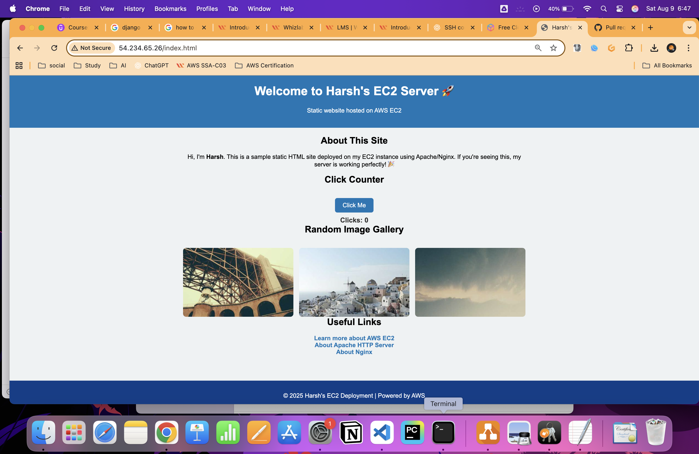

# Apache Web Server Setup on AWS EC2

This repository documents the steps to install and configure an Apache Web Server on an Amazon EC2 instance, publish a custom web page, and verify its functionality via a web browser.

---

## Task 5: Install Apache Server on the EC2 Instance

### Step 1: Switch to root user
```bash
sudo su
````

### Step 2: Update the instance packages

```bash
dnf update -y
```

### Step 3: Install Apache web server

```bash
dnf install httpd -y
```

### Step 4: Start the Apache web server

```bash
systemctl start httpd
```

### Step 5: Enable Apache to start on boot

```bash
systemctl enable httpd
```

### Step 6: Verify Apache service status

```bash
systemctl status httpd
```

* You should see the status as *active (running)*.

### Step 7: Test the Apache server

* Open a web browser and enter the **public IPv4 address** of your EC2 instance.
* You should see the default **Apache test page** confirming the web server is running.

> **Note:**
> If you don’t see the Apache page, ensure your **EC2 Security Group** inbound rules allow HTTP traffic (port 80).

---

## Task 6: Create and Publish a Custom Web Page

### Step 1: Add content to the `index.html` file

Run the following command to create a simple web page:

```bash
echo "<html>Hi Whizlabs, I am a public page</html>" > /var/www/html/index.html
```

### Step 2: Restart Apache server to apply changes

```bash
systemctl restart httpd
```

### Step 3: Verify your custom page

* In your web browser, enter the URL:

  ```
  http://<Your_Public_IPv4_Address>/index.html
  ```
* You should see the custom message:
  *Hi Whizlabs, I am a public page*

> **Important:**
> Make sure to use the **HTTP** protocol, not HTTPS.

---

## Additional Tips

* Always verify your **Security Group** inbound rules to allow traffic on the required ports (e.g., port 80 for HTTP).
* You can manage the Apache server with `systemctl` commands like `start`, `stop`, `restart`, and `status`.
* For further customization, replace the contents of `/var/www/html/index.html` with your own HTML.

---

## Sample AWS & Linux Commands

Below are some useful AWS CLI and Linux commands for EC2 and server management:

```bash
aws configure
aws ec2 list
aws ec2 describe-instances
aws configure
cd Downloads 
ssh -i MyKey\ \(1\).pem ec2-user@54.234.65.26
ssh -i MyKey.pem ec2-user@54.234.65.26
chmod 400 MyKey.pem 
ssh -i MyKey.pem ec2-user@54.234.65.26
sudo su
dnf update -y
dnf install httpd -y
vi index.html
cat index.html 
systemctl restart httpd
rm index.html 
vi index.html
systemctl restart httpd
```

---

## References

* [Amazon EC2 Documentation](https://docs.aws.amazon.com/ec2/)
* [Apache HTTP Server Documentation](https://httpd.apache.org/docs/)
* [AWS Security Groups](https://docs.aws.amazon.com/vpc/latest/userguide/VPC_SecurityGroups.html)


---

*This README was created to assist with Apache server setup and deployment on an AWS EC2 instance.*



